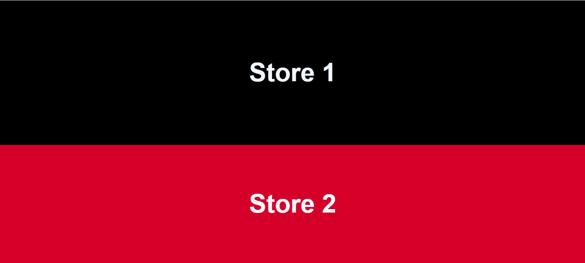
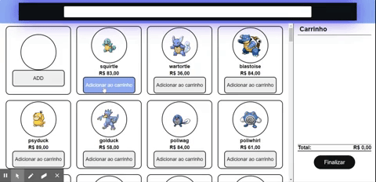
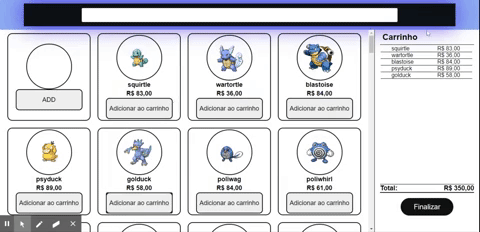
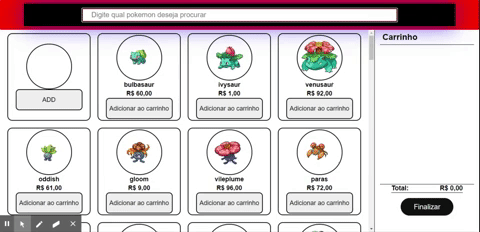
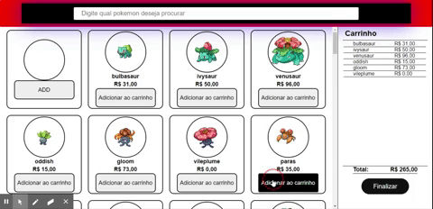

  

Projeto desenvolvido para o processo seletivo da <a href="https://ri.b2w.digital/">B2W Digital</a>. O objetivo do desafio era vivênciar a experiência de construir uma loja virtual de Pokémon.

## Instalando projeto

- Clone o projeto
- Digite o comando "npm i" no terminal para instalar as dependeicias do projeto.
- Digite o comando "npm start" para exercutar o projeto.

## Features

Os Pokémon devem ser exibidos a partir da <a href="https://pokeapi.co/">pokeapi</a>, uma api RESTful com dados de quase todos os Pokémon. Além disso, as features pedidas no MVP:

- [x] Catálogo de produtos
- [x] Carrinho lateral
- [x] Resumo do carrinho
- [x] 2 lojas com estilos e tipos diferentes de Pokémon
- [x] Valores gerados aleatoriamente
- [x] Ser responsivo

## Bonus features

- [x] Barra de busca para filtrar os Pokémon
- [ ] Botão de finalizar compra, reiniciando o processo de compra
- [x] Modal de obrigado ao finalizar compra
- [ ] Salvar os dados da compra do usuário localmente para não perdê-las ao atualizar a página

## Tecnologias usadas

- [x] ReactJS
- [x] React Router
- [x] Axios (HTTP Client)

## Imagens do projeto

- Duas lojas conforme descrito no teste

  

* Adicionando os Pokémon ao carrinho e somando os preços

  

* Site responsivo

  

- Barra de busca para filtrar os Pokémon

  

- Modal de obrigado ao finalizar compra

  

